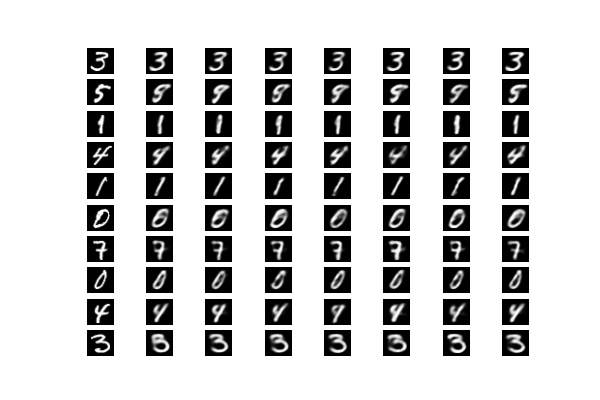

# Variational Autoencoder - MNIST Dataset

---

Simple VAE model from Pytorch to generate handwritten digits.

> Paper: [Auto-Encoding Variational Bayes](https://arxiv.org/pdf/1312.6114.pdf) by Kingma et al.

---

## Environment

Install required package

```bash
pip3 install -r requirements.txt
```

---

## Run

```bash
python main.py --img-shape 28 --batch-size 64 --epochs 10 --load-model false
```

#### Program Argument

`-lr`: Learning rate (default $3e-4$) \
`--disable-cuda`: Disable cuda (default False) \
`--batch-size`: Batch size (default 64) \
`--save-model`: Save model directory (default ./model) \
`--dir`: Data directory (default ./data) \
`--img-shape`: Image shape (default MNIST 28) \
`--h-dim`: hidden dimension (default 256) \
`--z-dim`: latent dimension (default 32) \
`--epochs`, `-e`: Epochs (default 10) \
`--num-workers`: subprocesses to use for dataloading\
`--load-model`: Load existing model (default false)

## Experience

- Epochs: 16
- Loss: 8719.13


